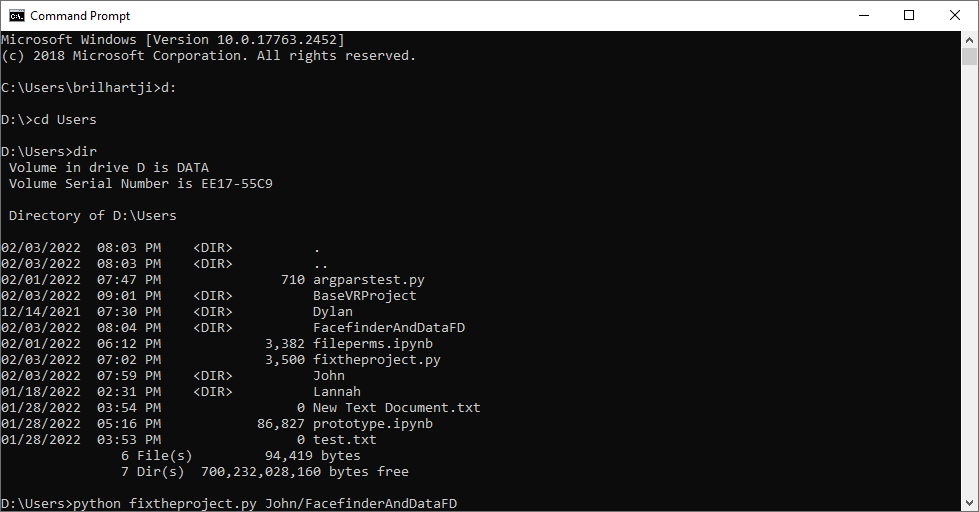

# UnrealVRProjectFixR
Fixes our unreal project not tracking motion controllers with the HTC Vive

# Dependancies
Make sure you have a newer version of python 3.10ish, and also have python setup correctly on your windows path. (This is already done on the lab computer.)


# Usage
For use specifically on the lab computer, but the steps can be genneralized.

## On Windows command line
Use: ```:d``` for moving into the D: drive. Then use ```cd /users``` to move into the user directory where the workspaces are stored. Make sure the project folder where your unreal project is stored is not read-only. Finally, type ```python fixtheproject.py ,/(your unreal project here)``` If errors occur they will be in the output.

